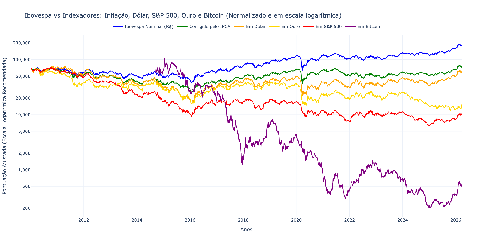

# Trading with Data

Comparativo do índice iBovespa, medido em **Reais nominais**, com outros índices financeiros, tais como o **IPCA**, convertido para **Dólar**, ajustado ao **Ouro** e **Bitcoin** (este último com dados históricos desde 2010).

> Veja o [CHANGELOG](CHANGELOG.md) para o histórico de versões.

---

## Requisitos

- Python **3.10+**
- `git` (opcional, para clonar o repositório)

---

## Instalação

### 1. Clone o repositório (ou abra a pasta no VS Code)

```bash
git clone https://github.com/<seu-usuario>/TradingWithData.git
cd TradingWithData
```

### 2. Crie e ative o ambiente virtual

```bash
# Criar
python3 -m venv .venv

# Ativar — macOS / Linux
source .venv/bin/activate

# Ativar — Windows (PowerShell)
.venv\Scripts\Activate.ps1
```

### 3. Instale as dependências

```bash
pip install -r requirements.txt
```

As bibliotecas instaladas são:

| Pacote    | Finalidade                                      |
|-----------|-------------------------------------------------|
| `yfinance`| Download de cotações históricas (Yahoo Finance) |
| `sidrapy` | Coleta do IPCA via API SIDRA (IBGE)             |
| `pandas`  | Manipulação e tratamento de dados               |
| `plotly`  | Geração do gráfico interativo                   |
| `kaleido` | Exportação do gráfico como imagem PNG           |

---

## Execução

### Script Python

Com o ambiente virtual ativado, execute:

```bash
python src/index_comparator.py
```

O script irá:
1. Baixar cotações históricas do Ibovespa, USD/BRL, BTC/USD, Ouro Futuro e S&P 500 (via yfinance)
2. Buscar o IPCA mensal histórico via SIDRA/IBGE
3. Calcular o Ibovespa em cada perspectiva (nominal, real, dólar, ouro, S&P 500 e bitcoin)
4. Salvar o gráfico interativo como HTML em `docs/index.html` (publicado no GitHub Pages)
5. Salvar o gráfico como imagem PNG em `output/ibovespa_comparativo.png`
6. Abrir o gráfico interativo no seu navegador padrão (apenas localmente).

### Listar a composição atual do Ibovespa

Para consultar a carteira teórica atual do índice direto da B3:

```bash
python src/ibovespa_components.py
```

Opções úteis:

```bash
# Salvar a composição em CSV
python src/ibovespa_components.py --csv output/ibovespa_components.csv

# Exibir em JSON
python src/ibovespa_components.py --json
```

### Listar os FIIs que compõem o IFIX

Para consultar a carteira teórica atual do Índice de Fundos de Investimentos Imobiliários (IFIX), direto da B3:

```bash
python src/ifix_components.py
```

Opções úteis:

```bash
# Salvar a composição em CSV
python src/ifix_components.py --csv output/ifix_components.csv

# Exibir em JSON
python src/ifix_components.py --json
```

### Ranking de valorização/desvalorização dos componentes

Para gerar uma tabela ordenada do ativo mais valorizado para o menos valorizado, usando por padrão o período de hoje até 4 anos atrás:

```bash
python src/ibovespa_performance.py
```

Opções úteis:

```bash
# Últimos 2 anos
python src/ibovespa_performance.py --years 2

# Período customizado
python src/ibovespa_performance.py --start-date 2021-01-01 --end-date 2026-08-18

# Exportar para CSV
python src/ibovespa_performance.py --csv output/ibovespa_performance.csv

# Exibir em JSON
python src/ibovespa_performance.py --json

# Gerar gráfico com 10 ações (5 maiores altas e 5 maiores quedas) + Ibovespa
python src/ibovespa_performance.py --plot-count 10 --no-show
```

Quando `--plot-count` é informado, o script seleciona metade das ações entre as maiores valorizações e metade entre as maiores desvalorizações, sempre incluindo o próprio **Ibovespa**, e salva o gráfico em `output/ibovespa_performance_plot.html`.
No painel exibido ao passar o mouse, a variação percentual em relação ao início do período é exibida por padrão. Use o botão **Valores (R$ / pontos)** para ver as cotações em reais dos ativos e a cotação do índice em pontos.

### Ranking e gráfico dos componentes do IFIX

O mesmo ranking e gráfico estão disponíveis para os FIIs da carteira atual do IFIX:

```bash
python src/ifix_performance.py
```

Para gerar um gráfico com `N` FIIs - divididos entre as maiores altas e as maiores quedas - mais a série do próprio **IFIX**:

```bash
python src/ifix_performance.py --plot-count 10 --no-show
```

O gráfico é salvo em `output/ifix_performance_plot.html`. No botão **Valores (R$ / pontos)**, as cotas dos FIIs são exibidas em reais e o IFIX permanece em pontos, que é sua unidade de cotação. As opções `--years`, `--start-date`, `--end-date`, `--csv` e `--json` funcionam da mesma forma que no comando do Ibovespa.

### Notebook Jupyter

Abra o arquivo `10_Trading_com_Dados_IBOV_em_Dolar,_IPCA_e_BTC.ipynb` diretamente no VS Code ou no Jupyter Lab:

```bash
# Instale o Jupyter se necessário
pip install notebook

jupyter notebook
```

---

## Testes

### Instalar dependências de teste

```bash
pip install -r requirements-test.txt
```

### Rodar suíte padrão (rápida)

```bash
pytest -q
```

### Rodar execução completa do notebook (mais lenta)

```bash
RUN_NOTEBOOK_TESTS=1 pytest -q
```

Observações:
1. O teste de notebook executa o arquivo inteiro e depende de internet para baixar dados das APIs.
2. Em CI, falha na exportação do PNG interrompe o pipeline para evitar publicação parcial.

---

## Visualização Online (GitHub Pages)

O gráfico é publicado automaticamente em:

> **`https://<seu-usuario>.github.io/TradingWithData`**

Um **GitHub Actions** (`.github/workflows/update_chart.yml`) roda o script toda semana (segundas às 8h BRT) e publica o resultado sem necessidade de IDE ou instalação local. Você também pode acionar a atualização manualmente pela aba **Actions** do repositório.

Comportamento do workflow:
1. **pull_request (main):** roda apenas testes rápidos (sem notebook completo) para feedback mais rápido.
2. **schedule:** roda testes rápidos + notebook completo e só depois atualiza `docs/`.
3. **workflow_dispatch:** por padrão roda testes rápidos; você pode ativar o input `run_notebook_tests` para incluir notebook completo.

Para ativar o GitHub Pages no seu repositório:
1. Vá em **Settings → Pages**
2. Em *Source*, selecione a branch `main` e a pasta `/docs`
3. Salve e aguarde alguns minutos

---

## Estrutura do Projeto

```
TradingWithData/
├── .github/
│   └── workflows/
│       └── update_chart.yml  # GitHub Actions — atualização semanal automática
├── docs/
│   └── index.html            # Gráfico interativo (GitHub Pages)
├── src/
│   ├── ibovespa_components.py # Consulta da composição atual do Ibovespa
│   ├── ifix_components.py     # Consulta da composição atual do IFIX
│   ├── ibovespa_performance.py # Ranking de valorização/desvalorização dos componentes
│   ├── ifix_performance.py    # Ranking e gráfico dos componentes do IFIX
│   └── index_comparator.py    # Script principal
├── output/
│   └── ibovespa_comparativo.png  # Imagem gerada na última execução
├── 10_Trading_com_Dados_IBOV_em_Dolar,_IPCA_e_BTC.ipynb
├── requirements.txt          # Dependências Python
├── CHANGELOG.md              # Histórico de versões
└── README.md
```

---

## Resultado Esperado

Um gráfico interativo (abre no navegador) com seis curvas normalizadas, desde 2010:

- **Ibovespa Nominal (R$)**
- **Corrigido pelo IPCA**
- **Em Dólar (USD)**
- **Em Ouro**
- **Em S&P 500**
- **Em Bitcoin**

Além disso, o script `src/ibovespa_components.py` lista os ativos que compõem a carteira teórica atual do índice na data retornada pela B3, e `src/ibovespa_performance.py` gera o ranking de valorização/desvalorização desses componentes para um período configurável, com opção de plotar as maiores altas, as maiores quedas e o **Ibovespa** em um gráfico interativo.
Os scripts `src/ifix_components.py` e `src/ifix_performance.py` oferecem a mesma consulta e visualização para os FIIs da carteira teórica atual do **IFIX**.

O eixo Y usa escala logarítmica para facilitar a comparação entre ativos de magnitudes muito diferentes.

Um arquivo PNG também é salvo automaticamente em `output/ibovespa_comparativo.png` a cada execução.


